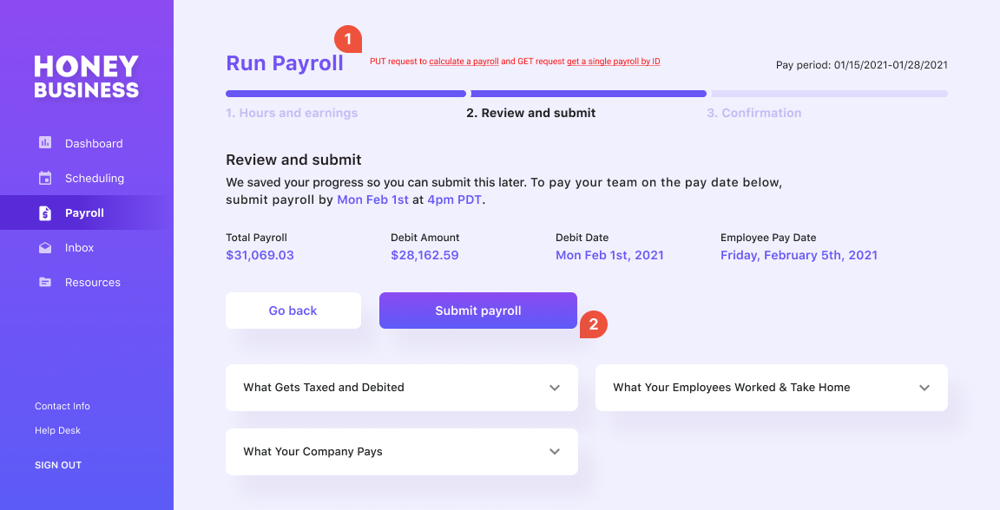
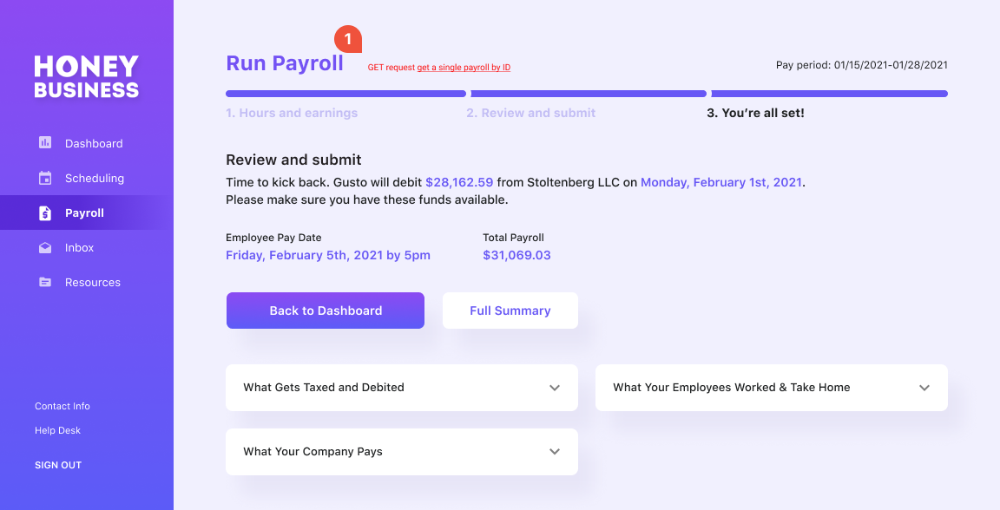
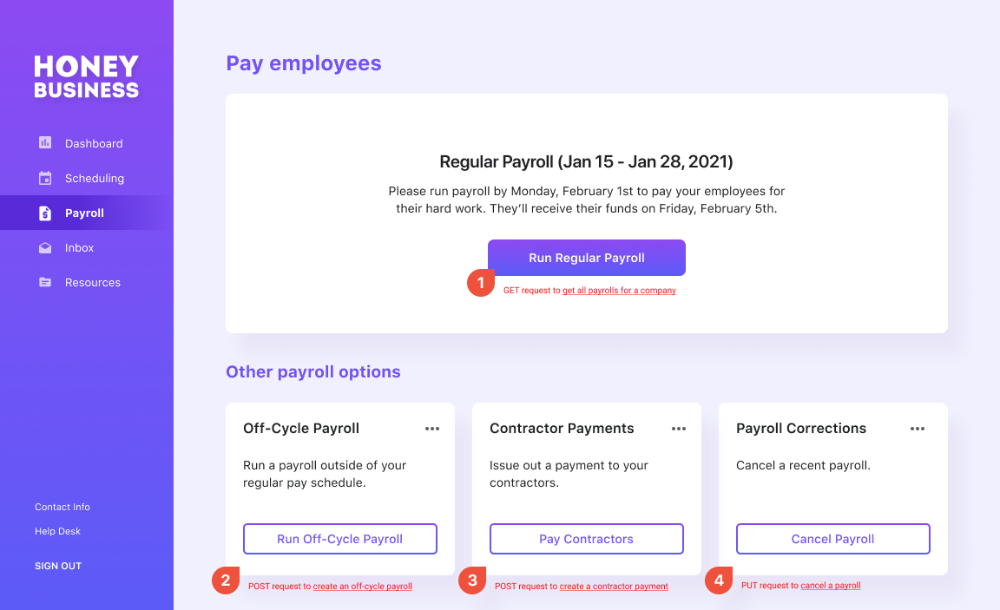
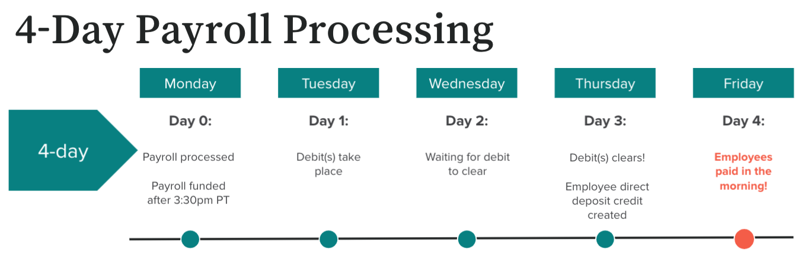

### Getting started

To kick off development, go to Gusto's Developer Portal at [dev.gusto.com](https://dev.gusto.com/) to obtain API keys, stand up a demo application, and try API requests to get a feel for what’s possible with Gusto’s Payroll APIs. If you want to learn more about how to use these endpoints in production, [apply for early access](https://gusto-embedded-payroll.typeform.com/to/iomAQIj3?utm_source=docs) and our Partnerships team will reach out to you. *Please note this may require you to enter a different agreement with Gusto given the sensitive nature of running payroll.*

The instructions below assume that the application is already authenticated, and that the bearer token is being specified via the Authorization HTTP header.

A Company will need to be fully onboarded before payroll can be processed.  This includes the configuration of Federal and State taxes and a pay schedule. [Payroll Fundamentals](https://docs.gusto.com/docs/api/ZG9jOjE0NDc2ODMx-payroll-fundamentals) goes into detail on this.

### Process a regular payroll

Your embedded payroll product allows the Company to pay the Employees the right amount at the right cadence, while accounting for tax implications.

The `pay_schedule` object in Gusto API includes details of when employees work and when they should be paid. It establishes pay periods with `start_date` and `end_date`. We automatically pre-generate scheduled regular payrolls based on the company’s pay schedule and corresponding pay periods. Pay periods are the foundation of payroll. Compensation, time & attendance, taxes, and expense reports all rely on when they happened. To begin submitting information for a given payroll, we need to agree on the time period.

To run a regular payroll, start by selecting an open pay period. Upcoming regular payrolls can be retrieved through a GET request to the [Payroll endpoint](https://docs.gusto.com/docs/api/reference/Gusto-API.v1.yaml/paths/~1v1~1companies~1%7Bcompany_id%7D~1payrolls/get) and the next upcoming payroll will be the earliest unprocessed payroll. Use the optional parameters to narrow down the response (e.g processed = false).

To make changes to the upcoming payroll, use the [update payroll endpoint](https://docs.gusto.com/docs/api/reference/Gusto-API.v1.yaml/paths/~1v1~1companies~1%7Bcompany_id%7D~1payrolls~1%7Bpay_period_start_date%7D~1%7Bpay_period_end_date%7D/put). Key inputs include hours (regular, overtime, double overtime), earnings (salaries, bonuses, commissions, tips, reimbursements), and time off (vacation, sick, holiday).

The payrolls are identified by their pay periods’ `start_date` and `end_date`. Both are required and must correspond with an existing, unprocessed payroll. If the dates do not match, the entire request will be rejected. A step-by-step guide to update the unprocessed payroll initially is available [here](https://docs.gusto.com/docs/api/docs/guides/Updating%20Payrolls.md).

**A payroll must first be updated with the `update payroll` API to create a unique ID for the payroll. [Check out this guide](https://docs.gusto.com/docs/api/ZG9jOjUyNzMzNjU-updating-payrolls) for more specific details on how to do this.**

This `payroll_id` can then be used to:
1. [Get a single payroll by ID](https://gusto.stoplight.io/docs/api/b3A6MTQ3MTExMjc-get-a-single-payroll)
2. [Calculate a Payroll](https://docs.gusto.com/docs/api/reference/Gusto-API.v1.yaml/paths/~1v1~1companies~1%7Bcompany_id%7D~1payrolls~1%7Bpayroll_id%7D~1calculate/put)
3. [Submit Payroll](https://docs.gusto.com/docs/api/reference/Gusto-API.v1.yaml/paths/~1v1~1companies~1%7Bcompany_id%7D~1payrolls~1%7Bpayroll_Id%7D~1submit/put)
4. [Cancel a Payroll](https://docs.gusto.com/docs/api/reference/Gusto-API.v1.yaml/paths/~1v1~1companies~1%7Bcompany_id%7D~1payrolls~1%7Bpayroll_id%7D~1cancel/put)

These 4 type of requests cannot be completed without a payroll_ID. A Payroll_id is only generated once a payroll is first updated via [this method](https://docs.gusto.com/docs/api/ZG9jOjUyNzMzNjU-updating-payrolls) or processed.

Once a payroll is updated, call the `calculate a payroll` endpoint. This performs calculations for taxes, benefits, and deductions for an unprocessed payroll. The calculated payroll details provide a preview of the actual values that will be used when the payroll is run. Any benefits or deductions (mandatory or voluntary) that are set up for the employee at the time payroll is calculated will automatically be factored in.

This endpoint is asynchronous and responds with only a 202 HTTP status. To view the details of the calculated payroll, use the `GET a single payroll by ID` endpoint with the *`show_calculation`* and *`includes`* parameters.

We recommend building a UI where the user can review their payroll before submitting. The displayed information can be customized to fit your unique business needs, but we highly recommend a preview step to provide the user with the payroll details before they finalize it. Typically this includes a breakdown of taxes and debits, similar to the one below. 

If everything looks accurate, a payroll can be processed with a request to the `submit payroll` API. Upon success, this request transitions the payroll to the processed state and initiates the transfer of funds. 

**This is a critical step to process payroll. A payroll is not finalized without calling this endpoint.**

In some cases, a payroll may be submitted with incorrect payroll information. A request to the `cancel a payroll` endpoint will cancel the specified payroll. This request transitions a `processed` payroll back to the `unprocessed` state. 

**Important:** a payroll cannot be canceled after 3:30pm PST on the `payroll_deadline`. *If a customer needs to cancel a payroll after this time frame they will need to contact support.*

### Process an off-cycle payroll

[One-off (or 'off-cycle') payrolls](https://support.gusto.com/payroll/processing-payrolls/off-cycle-payrolls/999908231/Run-an-off-cycle-payroll.htm) are available if you need to pay your team outside of the regular payroll schedule. [Reasons for an off-cycle](https://support.gusto.com/payroll/processing-payrolls/off-cycle-payrolls/1019772541/Reasons-for-running-an-off-cycle-payroll.htm) can vary. Unlike regular payrolls, off-cycle payrolls are ad-hoc and do not have a set schedule.

To run an off-cycle payroll, the admin starts by entering the pay period start and end date. Key inputs include check date, any deductions and contributions, tax withholding rates, hours and additional earnings, and time off. Note that off-cycle payrolls default to using the same withholding rates, deductions, and contributions made in regular payrolls.

A POST request to the `create an off-cycle payroll` endpoint creates a new, unprocessed, off-cycle payroll and returns a unique `payroll_id`. 

To make any changes to the created off-cycle, call the `update a payroll by ID `endpoint (e.g adding additional hours to be paid or adding/increasing fixed_compensations)

Similar to processing a regular payroll, call the `calculate a payroll` endpoint using the unique `payroll_id` for the off-cycle. The calculated payroll details provide a preview of the actual values that will be used when the payroll is run.

To view the details of the calculated payroll, use the ``GET a single payroll by ID` endpoint with the *`show_calculation`* and *`includes`* parameters.

If everything looks accurate, a payroll can be processed with a request to the `submit payroll` API. Upon success, this request transitions the payroll to the processed state and initiates the transfer of funds. **This is a critical step to process payroll. A payroll is not finalized without calling this endpoint.**

The `cancel a payroll` endpoint can also revert a `processed` payroll back to the `unprocessed` state. 

*As a reminder, a payroll cannot be canceled after 3:30pm PST on the `payroll_deadline`. If a customer needs to cancel a payroll after this time frame they will need to contact support.*

### Process contractor payments

Similar to off-cycle payrolls, contractor payments are ad-hoc and do not have a set schedule.

A POST request to the [create a contractor payment endpoint](https://docs.gusto.com/docs/api/reference/Gusto-API.v1.yaml/paths/~1v1~1companies~1%7Bcompany_id%7D~1contractor_payments/post) will return an object containing individual contractor payments, within a given time period, including totals. This will also return a unique contractor payment ID for the newly created payment (`uuid`)

**Important:** Unlike payrolls, this POST request creates and processes the contractor payment in one step. There is no need to submit the payment.

To review the payment, use the `uuid` obtained in the previous step to call the [get a single contractor payment](https://docs.gusto.com/docs/api/reference/Gusto-API.v1.yaml/paths/~1v1~1companies~1%7Bcompany_id%7D~1contractor_payments~1%7Bcontractor_payment_id%7D/get) endpoint. 

Similar to payrolls, a contractor payment can be canceled using the [cancel a contractor payment endpoint](https://docs.gusto.com/docs/api/reference/Gusto-API.v1.yaml/paths/~1v1~1companies~1%7Bcompany_id%7D~1contractor_payments~1%7Bcontractor_payment_id%7D/delete). This DELETE request reverts a processed payment back to the unprocessed state. 

*Similar to employee payrolls, a payment cannot be canceled once it has entered the `funded` state. If a contractor payment is already `funded` and needs to be canceled, the customer should contact Gusto directly to resolve.*

A GET request to the [contractor payments for a company endpoint](https://docs.gusto.com/docs/api/reference/Gusto-API.v1.yaml/paths/~1v1~1companies~1%7Bcompany_id%7D~1contractor_payments/get) returns an object containing individual contractor payments, within a given time period, including totals. To GET payments for a particular time period, include the `start_date` and `end_date` parameters.

### Payroll processing timeline
Today, we only support the creation of 4-day payrolls when paid by direct deposit via our API because of the way Automated Clearing House (ACH) works. ACH is a way to move money between banks without using paper checks, wire transfers, credit card networks, or cash. At Gusto, we use ACH for direct deposits to employees. We’re working on introducing faster payroll options in the near future. 

*Gusto.com can do faster pay and we’re working on introducing faster payroll options for our GEP Partners in the near future.*

