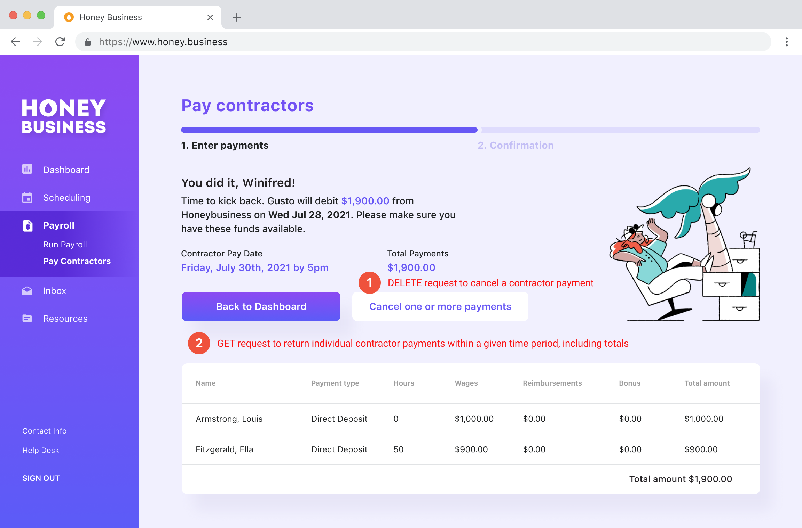

# Process Contractor Payments

Similar to off-cycle payrolls, contractor payments are ad-hoc and do not have a set schedule.

A POST request to the [create a contractor payment endpoint](https://docs.gusto.com/docs/api/reference/Gusto-API.v1.yaml/paths/~1v1~1companies~1%7Bcompany_id%7D~1contractor_payments/post) will return an object containing individual contractor payments, within a given time period, including totals. This will also return a unique contractor payment ID for the newly created payment (`uuid`)

**Important:** Unlike payrolls, this POST request creates and processes the contractor payment in one step. There is no need to submit the payment.

To review the payment, use the `uuid` obtained in the previous step to call the [get a single contractor payment](https://docs.gusto.com/docs/api/reference/Gusto-API.v1.yaml/paths/~1v1~1companies~1%7Bcompany_id%7D~1contractor_payments~1%7Bcontractor_payment_id%7D/get) endpoint. 

Similar to payrolls, a contractor payment can be canceled using the [cancel a contractor payment endpoint](https://docs.gusto.com/docs/api/reference/Gusto-API.v1.yaml/paths/~1v1~1companies~1%7Bcompany_id%7D~1contractor_payments~1%7Bcontractor_payment_id%7D/delete). This DELETE request reverts a processed payment back to the unprocessed state. 

*Similar to employee payrolls, a payment cannot be canceled once it has entered the `funded` state. If a contractor payment is already `funded` and needs to be canceled, the customer should contact Gusto directly to resolve.*

A GET request to the [contractor payments for a company endpoint](https://docs.gusto.com/docs/api/reference/Gusto-API.v1.yaml/paths/~1v1~1companies~1%7Bcompany_id%7D~1contractor_payments/get) returns an object containing individual contractor payments, within a given time period, including totals. To GET payments for a particular time period, include the `start_date` and `end_date` parameters.