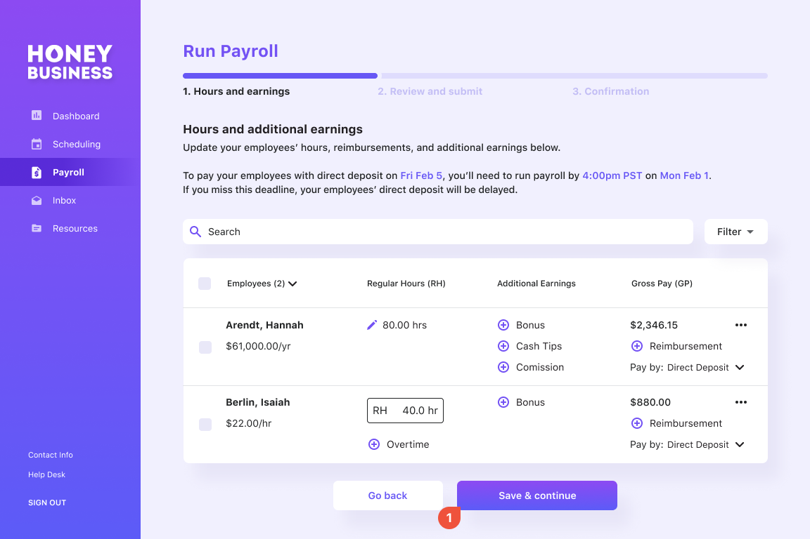
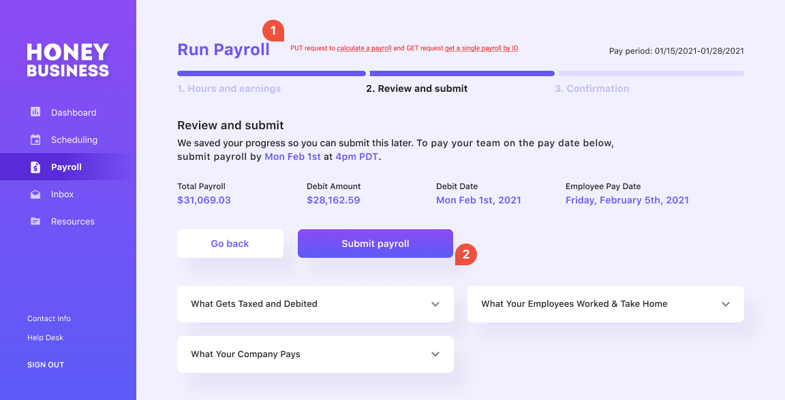
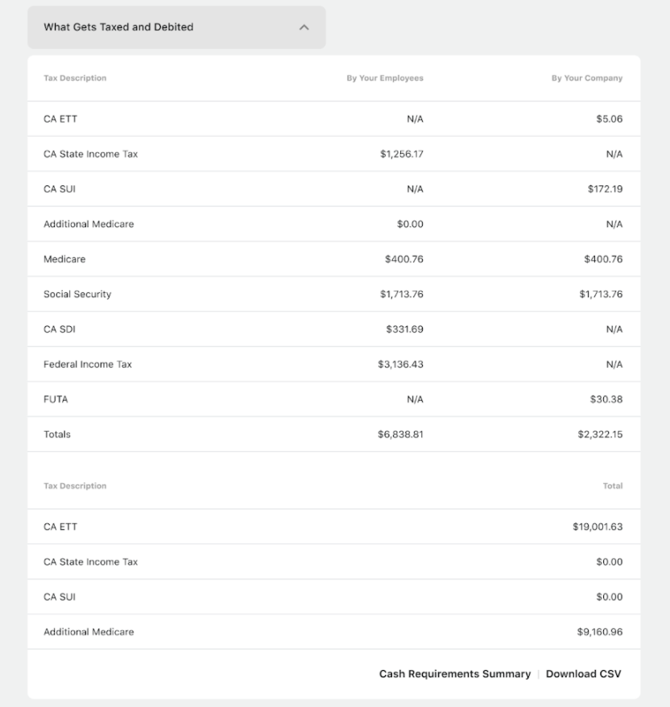
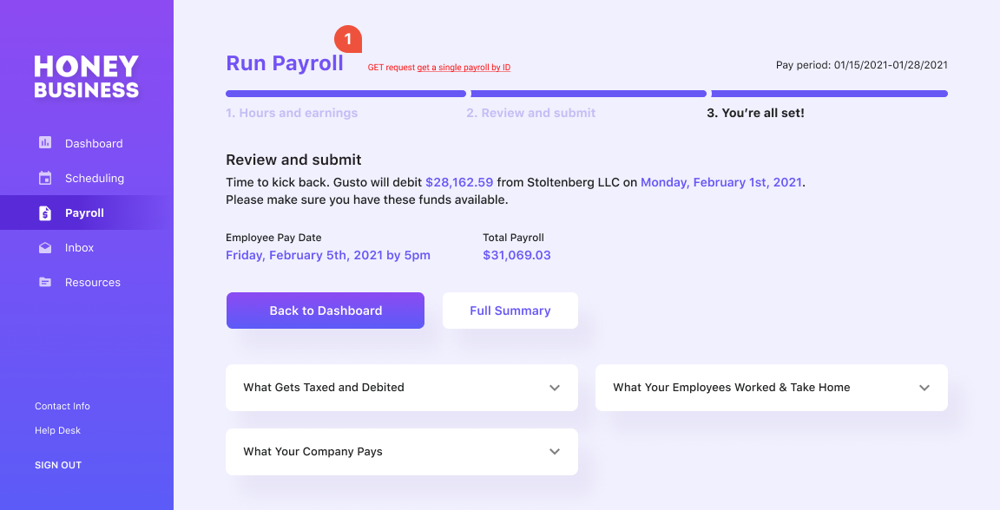
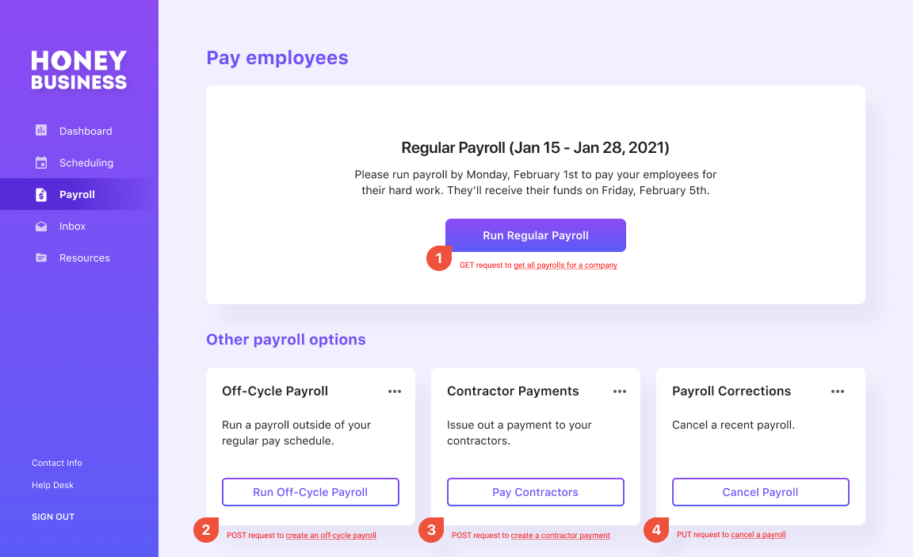

# Process Regular Payroll

### Video Tutorial

Watch a tutorial of the payroll APIs [here](https://www.loom.com/share/1449cd1c5c5049b7a2084e7d42fcccbd).

Your embedded payroll product allows the Company to pay the Employees the right amount at the right cadence, while accounting for tax implications.

The `pay_schedule` object in Gusto API includes details of when employees work and when they should be paid. It establishes pay periods with `start_date` and `end_date`. We automatically pre-generate scheduled regular payrolls based on the company’s pay schedule and corresponding pay periods. Pay periods are the foundation of payroll. Compensation, time & attendance, taxes, and expense reports all rely on when they happened. To begin submitting information for a given payroll, we need to agree on the time period.

To run a regular payroll, start by selecting an open pay period. Upcoming regular payrolls can be retrieved through a GET request to the [Payroll endpoint](https://docs.gusto.com/docs/api/reference/Gusto-API.v1.yaml/paths/~1v1~1companies~1%7Bcompany_id%7D~1payrolls/get) and the next upcoming payroll will be the earliest unprocessed payroll. Use the optional parameters to narrow down the response (e.g processed = false).

To make changes to the upcoming payroll, use the [update payroll endpoint](https://docs.gusto.com/docs/api/reference/Gusto-API.v1.yaml/paths/~1v1~1companies~1%7Bcompany_id%7D~1payrolls~1%7Bpay_period_start_date%7D~1%7Bpay_period_end_date%7D/put). Key inputs include hours (regular, overtime, double overtime), earnings (salaries, bonuses, commissions, tips, reimbursements), and time off (vacation, sick, holiday).

The payrolls are identified by their pay periods’ `start_date` and `end_date`. Both are required and must correspond with an existing, unprocessed payroll. If the dates do not match, the entire request will be rejected. A step-by-step guide to update the unprocessed payroll initially is available [here](https://docs.gusto.com/docs/api/docs/guides/Updating%20Payrolls.md).

**A payroll must first be updated with the `update payroll` API to create a unique ID for the payroll. [Check out this guide](https://docs.gusto.com/docs/api/ZG9jOjUyNzMzNjU-updating-payrolls) for more specific details on how to do this.**

This `payroll_id` can then be used to:
1. [Get a single payroll by ID](https://gusto.stoplight.io/docs/api/b3A6MTQ3MTExMjc-get-a-single-payroll)
2. [Calculate a Payroll](https://docs.gusto.com/docs/api/reference/Gusto-API.v1.yaml/paths/~1v1~1companies~1%7Bcompany_id%7D~1payrolls~1%7Bpayroll_id%7D~1calculate/put)
3. [Submit Payroll](https://docs.gusto.com/docs/api/reference/Gusto-API.v1.yaml/paths/~1v1~1companies~1%7Bcompany_id%7D~1payrolls~1%7Bpayroll_Id%7D~1submit/put)
4. [Cancel a Payroll](https://docs.gusto.com/docs/api/reference/Gusto-API.v1.yaml/paths/~1v1~1companies~1%7Bcompany_id%7D~1payrolls~1%7Bpayroll_id%7D~1cancel/put)

These 4 type of requests cannot be completed without a payroll_ID. A Payroll_id is only generated once a payroll is first updated via [this method](https://docs.gusto.com/docs/api/ZG9jOjUyNzMzNjU-updating-payrolls) or processed.

Once a payroll is updated, call the `calculate a payroll` endpoint. This performs calculations for taxes, benefits, and deductions for an unprocessed payroll. The calculated payroll details provide a preview of the actual values that will be used when the payroll is run. Any benefits or deductions (mandatory or voluntary) that are set up for the employee at the time payroll is calculated will automatically be factored in.

This endpoint is asynchronous and responds with only a 202 HTTP status. To view the details of the calculated payroll, use the `GET a single payroll by ID` endpoint with the *`show_calculation`* and *`includes`* parameters.

We recommend building a UI where the user can review their payroll before submitting. The displayed information can be customized to fit your unique business needs, but we highly recommend a preview step to provide the user with the payroll details before they finalize it. Typically this includes a breakdown of taxes and debits, similar to the one below. 

If everything looks accurate, a payroll can be processed with a request to the `submit payroll` API. Upon success, this request transitions the payroll to the processed state and initiates the transfer of funds. 

**This is a critical step to process payroll. A payroll is not finalized without calling this endpoint.**

In some cases, a payroll may be submitted with incorrect payroll information. A request to the `cancel a payroll` endpoint will cancel the specified payroll. This request transitions a `processed` payroll back to the `unprocessed` state. 

**Important:** a payroll cannot be canceled after 3:30pm PST on the `payroll_deadline`. *If a customer needs to cancel a payroll after this time frame they will need to contact support.*

